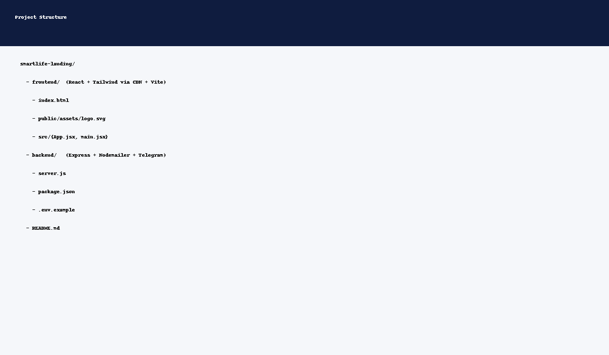
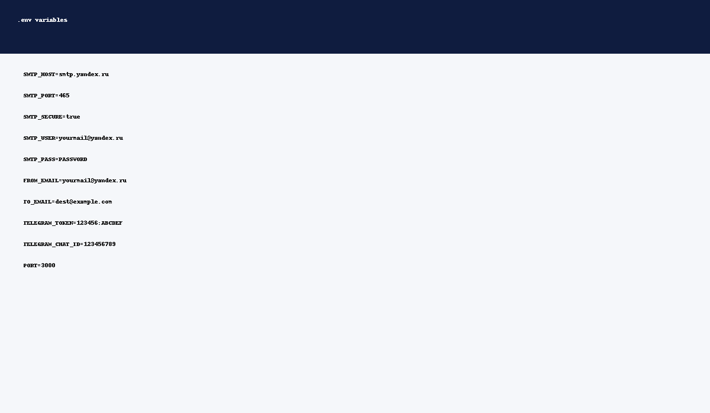
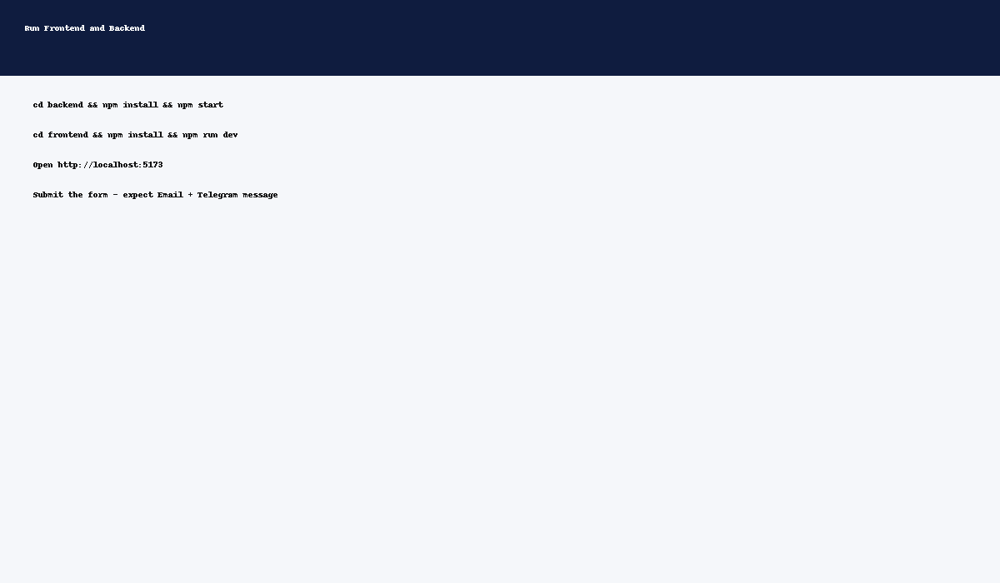

# SmartLife — лендинг видеонаблюдения (React + Node.js)

Готовый проект: **React + Tailwind** (frontend) и **Node.js + Express + Nodemailer + Telegram** (backend).

## 🚀 Быстрый старт
1. Установите Node.js LTS.
2. В двух терминалах запустите фронт и бэк.





### 1) Backend
```bash
cd backend
cp .env.example .env
# заполните .env своими данными
npm install
npm start
```
Сервер поднимется на `http://localhost:3000`.

### 2) Frontend
```bash
cd frontend
npm install
npm run dev
```
Vite покажет адрес, например `http://localhost:5173`.

> Форма отправляет POST на `/api/send`. Для разработки откройте dev-прокси в vite.config или запустите backend на 3000 и настройте проксирование запроса (см. ниже).

## 🔧 Настройка прокси (vite)
Создайте `vite.config.js` в корне `frontend`:
```js
import { defineConfig } from 'vite'
import react from '@vitejs/plugin-react'

export default defineConfig({
  plugins: [react()],
  server: {
    proxy: {
      '/api': 'http://localhost:3000'
    }
  }
})
```

Установите плагин:
```bash
npm i -D @vitejs/plugin-react
```

## 📦 Продакшн
- Соберите фронтенд: `npm run build` в `frontend` → положите содержимое `dist/` в `backend/public/` (статическая раздача).
- Запустите backend на сервере (PM2, systemd, Docker — на выбор).

## 🔐 Безопасность
- Используйте сложный пароль SMTP.
- Ограничьте CORS доменом.
- Добавьте капчу (hCaptcha/Cloudflare Turnstile/Google reCAPTCHA).

## 🧩 Где править
- Логотип: `frontend/public/assets/logo.svg`
- Контакты и тексты: `frontend/src/App.jsx`
- Email/Telegram: `backend/.env`
